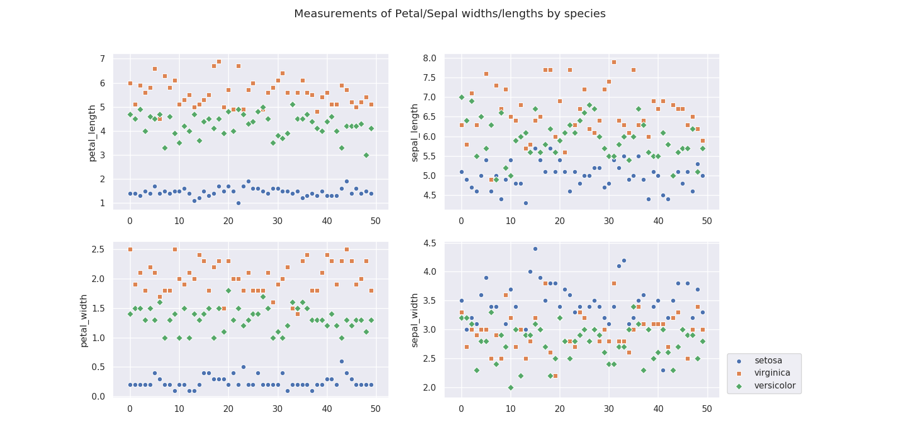
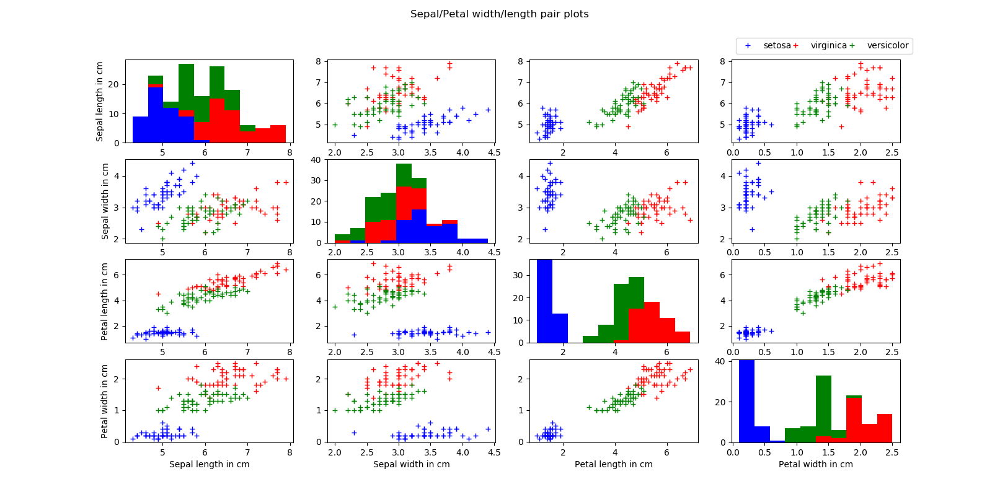
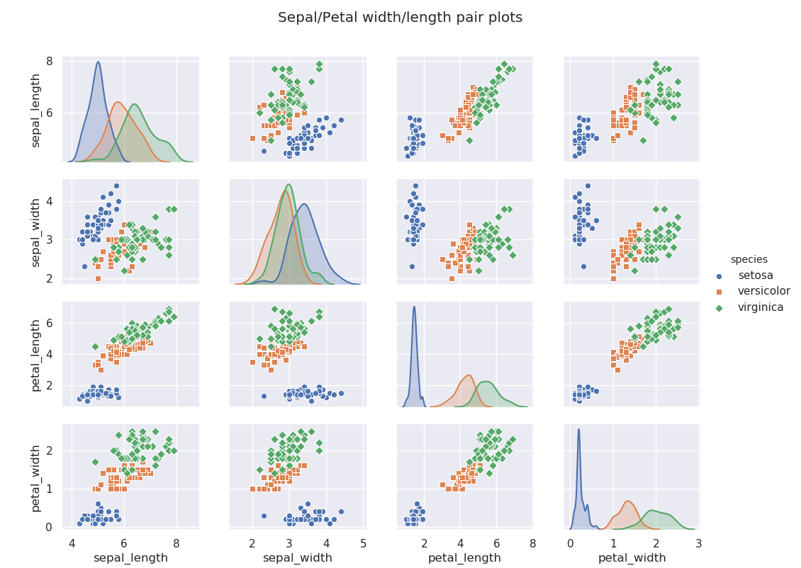

# pands-project The Fisher Iris Dataset

## Introduction
The Fisher Iris dataset is perhaps the best known database to be found in pattern recognition literature.[2] Although Ronald Fisher’s name is less well-known than some others, he was one of the twentieth century’s greatest scientists.
In addition to being probably the greatest statistician ever, he also invented experimental design and was one of the principal founders of population genetics. He unified the disconnected concepts of natural selection and Mendel’s rules of inheritance. The importance of his book Statistical Methods for Research Workers in quantitative biology has been likened to that of Isaac Newton’s Principia in physics.
According to geneticist and author Richard Dawkins, Fisher was the greatest biologist since Charles Darwin.
Fisher viewed himself as a scientist who was especially interested in biology. He did not, however, enjoy learning the names and details of biological structures. He decided to study mathematics, believing it was through mathematics he could make the greatest contributions to biology.[6]

## The Iris dataset
The Iris flower dataset is a multivariate dataset introduced by the British statistician and biologist Ronald Fisher in his 1936 paper The use of multiple measurements in taxonomic problems. It is sometimes called Anderson's Iris dataset because Edgar Anderson collected the data to quantify the morphologic variation of Iris flowers of three related species.
The dataset consists of 50 samples from each of three species of Iris (Iris Setosa, Iris virginica, and Iris versicolor). Four features were measured from each sample: the length and the width of the sepals and petals, in centimeters.This dataset became a typical test case for many statistical classification techniques in machine learning.[5]
Two of the three species were collected in the Gaspe Peninsula, Quebec ”all from the same pasture, and picked on the same day and measured at the same time by the same person with the same apparatus”.[7]
One class is linearly separable from the other two; the latter are NOT linearly separable from each other.[3]

The picture below shows the three types of Iris with the first showing the sepal and petal.

The following table is the entire dataset with a column each for sepal length, sepal width, petal length, petal width and species. 

| sepal_length | sepal_width | petal_length | petal_width | species    | 
|--------------|-------------|--------------|-------------|------------| 
| 5.1          | 3.5         | 1.4          | 0.2         | setosa     | 
| 4.9          | 3.0         | 1.4          | 0.2         | setosa     | 
| 4.7          | 3.2         | 1.3          | 0.2         | setosa     | 
| 4.6          | 3.1         | 1.5          | 0.2         | setosa     | 
| 5.0          | 3.6         | 1.4          | 0.2         | setosa     | 
| 5.4          | 3.9         | 1.7          | 0.4         | setosa     | 
| 4.6          | 3.4         | 1.4          | 0.3         | setosa     | 
| 5.0          | 3.4         | 1.5          | 0.2         | setosa     | 
| 4.4          | 2.9         | 1.4          | 0.2         | setosa     | 
| 4.9          | 3.1         | 1.5          | 0.1         | setosa     | 
| 5.4          | 3.7         | 1.5          | 0.2         | setosa     | 
| 4.8          | 3.4         | 1.6          | 0.2         | setosa     | 
| 4.8          | 3.0         | 1.4          | 0.1         | setosa     | 
| 4.3          | 3.0         | 1.1          | 0.1         | setosa     | 
| 5.8          | 4.0         | 1.2          | 0.2         | setosa     | 
| 5.7          | 4.4         | 1.5          | 0.4         | setosa     | 
| 5.4          | 3.9         | 1.3          | 0.4         | setosa     | 
| 5.1          | 3.5         | 1.4          | 0.3         | setosa     | 
| 5.7          | 3.8         | 1.7          | 0.3         | setosa     | 
| 5.1          | 3.8         | 1.5          | 0.3         | setosa     | 
| 5.4          | 3.4         | 1.7          | 0.2         | setosa     | 
| 5.1          | 3.7         | 1.5          | 0.4         | setosa     | 
| 4.6          | 3.6         | 1.0          | 0.2         | setosa     | 
| 5.1          | 3.3         | 1.7          | 0.5         | setosa     | 
| 4.8          | 3.4         | 1.9          | 0.2         | setosa     | 
| 5.0          | 3.0         | 1.6          | 0.2         | setosa     | 
| 5.0          | 3.4         | 1.6          | 0.4         | setosa     | 
| 5.2          | 3.5         | 1.5          | 0.2         | setosa     | 
| 5.2          | 3.4         | 1.4          | 0.2         | setosa     | 
| 4.7          | 3.2         | 1.6          | 0.2         | setosa     | 
| 4.8          | 3.1         | 1.6          | 0.2         | setosa     | 
| 5.4          | 3.4         | 1.5          | 0.4         | setosa     | 
| 5.2          | 4.1         | 1.5          | 0.1         | setosa     | 
| 5.5          | 4.2         | 1.4          | 0.2         | setosa     | 
| 4.9          | 3.1         | 1.5          | 0.1         | setosa     | 
| 5.0          | 3.2         | 1.2          | 0.2         | setosa     | 
| 5.5          | 3.5         | 1.3          | 0.2         | setosa     | 
| 4.9          | 3.1         | 1.5          | 0.1         | setosa     | 
| 4.4          | 3.0         | 1.3          | 0.2         | setosa     | 
| 5.1          | 3.4         | 1.5          | 0.2         | setosa     | 
| 5.0          | 3.5         | 1.3          | 0.3         | setosa     | 
| 4.5          | 2.3         | 1.3          | 0.3         | setosa     | 
| 4.4          | 3.2         | 1.3          | 0.2         | setosa     | 
| 5.0          | 3.5         | 1.6          | 0.6         | setosa     | 
| 5.1          | 3.8         | 1.9          | 0.4         | setosa     | 
| 4.8          | 3.0         | 1.4          | 0.3         | setosa     | 
| 5.1          | 3.8         | 1.6          | 0.2         | setosa     | 
| 4.6          | 3.2         | 1.4          | 0.2         | setosa     | 
| 5.3          | 3.7         | 1.5          | 0.2         | setosa     | 
| 5.0          | 3.3         | 1.4          | 0.2         | setosa     | 
| 7.0          | 3.2         | 4.7          | 1.4         | versicolor | 
| 6.4          | 3.2         | 4.5          | 1.5         | versicolor | 
| 6.9          | 3.1         | 4.9          | 1.5         | versicolor | 
| 5.5          | 2.3         | 4.0          | 1.3         | versicolor | 
| 6.5          | 2.8         | 4.6          | 1.5         | versicolor | 
| 5.7          | 2.8         | 4.5          | 1.3         | versicolor | 
| 6.3          | 3.3         | 4.7          | 1.6         | versicolor | 
| 4.9          | 2.4         | 3.3          | 1.0         | versicolor | 
| 6.6          | 2.9         | 4.6          | 1.3         | versicolor | 
| 5.2          | 2.7         | 3.9          | 1.4         | versicolor | 
| 5.0          | 2.0         | 3.5          | 1.0         | versicolor | 
| 5.9          | 3.0         | 4.2          | 1.5         | versicolor | 
| 6.0          | 2.2         | 4.0          | 1.0         | versicolor | 
| 6.1          | 2.9         | 4.7          | 1.4         | versicolor | 
| 5.6          | 2.9         | 3.6          | 1.3         | versicolor | 
| 6.7          | 3.1         | 4.4          | 1.4         | versicolor | 
| 5.6          | 3.0         | 4.5          | 1.5         | versicolor | 
| 5.8          | 2.7         | 4.1          | 1.0         | versicolor | 
| 6.2          | 2.2         | 4.5          | 1.5         | versicolor | 
| 5.6          | 2.5         | 3.9          | 1.1         | versicolor | 
| 5.9          | 3.2         | 4.8          | 1.8         | versicolor | 
| 6.1          | 2.8         | 4.0          | 1.3         | versicolor | 
| 6.3          | 2.5         | 4.9          | 1.5         | versicolor | 
| 6.1          | 2.8         | 4.7          | 1.2         | versicolor | 
| 6.4          | 2.9         | 4.3          | 1.3         | versicolor | 
| 6.6          | 3.0         | 4.4          | 1.4         | versicolor | 
| 6.8          | 2.8         | 4.8          | 1.4         | versicolor | 
| 6.7          | 3.0         | 5.0          | 1.7         | versicolor | 
| 6.0          | 2.9         | 4.5          | 1.5         | versicolor | 
| 5.7          | 2.6         | 3.5          | 1.0         | versicolor | 
| 5.5          | 2.4         | 3.8          | 1.1         | versicolor | 
| 5.5          | 2.4         | 3.7          | 1.0         | versicolor | 
| 5.8          | 2.7         | 3.9          | 1.2         | versicolor | 
| 6.0          | 2.7         | 5.1          | 1.6         | versicolor | 
| 5.4          | 3.0         | 4.5          | 1.5         | versicolor | 
| 6.0          | 3.4         | 4.5          | 1.6         | versicolor | 
| 6.7          | 3.1         | 4.7          | 1.5         | versicolor | 
| 6.3          | 2.3         | 4.4          | 1.3         | versicolor | 
| 5.6          | 3.0         | 4.1          | 1.3         | versicolor | 
| 5.5          | 2.5         | 4.0          | 1.3         | versicolor | 
| 5.5          | 2.6         | 4.4          | 1.2         | versicolor | 
| 6.1          | 3.0         | 4.6          | 1.4         | versicolor | 
| 5.8          | 2.6         | 4.0          | 1.2         | versicolor | 
| 5.0          | 2.3         | 3.3          | 1.0         | versicolor | 
| 5.6          | 2.7         | 4.2          | 1.3         | versicolor | 
| 5.7          | 3.0         | 4.2          | 1.2         | versicolor | 
| 5.7          | 2.9         | 4.2          | 1.3         | versicolor | 
| 6.2          | 2.9         | 4.3          | 1.3         | versicolor | 
| 5.1          | 2.5         | 3.0          | 1.1         | versicolor | 
| 5.7          | 2.8         | 4.1          | 1.3         | versicolor | 
| 6.3          | 3.3         | 6.0          | 2.5         | virginica  | 
| 5.8          | 2.7         | 5.1          | 1.9         | virginica  | 
| 7.1          | 3.0         | 5.9          | 2.1         | virginica  | 
| 6.3          | 2.9         | 5.6          | 1.8         | virginica  | 
| 6.5          | 3.0         | 5.8          | 2.2         | virginica  | 
| 7.6          | 3.0         | 6.6          | 2.1         | virginica  | 
| 4.9          | 2.5         | 4.5          | 1.7         | virginica  | 
| 7.3          | 2.9         | 6.3          | 1.8         | virginica  | 
| 6.7          | 2.5         | 5.8          | 1.8         | virginica  | 
| 7.2          | 3.6         | 6.1          | 2.5         | virginica  | 
| 6.5          | 3.2         | 5.1          | 2.0         | virginica  | 
| 6.4          | 2.7         | 5.3          | 1.9         | virginica  | 
| 6.8          | 3.0         | 5.5          | 2.1         | virginica  | 
| 5.7          | 2.5         | 5.0          | 2.0         | virginica  | 
| 5.8          | 2.8         | 5.1          | 2.4         | virginica  | 
| 6.4          | 3.2         | 5.3          | 2.3         | virginica  | 
| 6.5          | 3.0         | 5.5          | 1.8         | virginica  | 
| 7.7          | 3.8         | 6.7          | 2.2         | virginica  | 
| 7.7          | 2.6         | 6.9          | 2.3         | virginica  | 
| 6.0          | 2.2         | 5.0          | 1.5         | virginica  | 
| 6.9          | 3.2         | 5.7          | 2.3         | virginica  | 
| 5.6          | 2.8         | 4.9          | 2.0         | virginica  | 
| 7.7          | 2.8         | 6.7          | 2.0         | virginica  | 
| 6.3          | 2.7         | 4.9          | 1.8         | virginica  | 
| 6.7          | 3.3         | 5.7          | 2.1         | virginica  | 
| 7.2          | 3.2         | 6.0          | 1.8         | virginica  | 
| 6.2          | 2.8         | 4.8          | 1.8         | virginica  | 
| 6.1          | 3.0         | 4.9          | 1.8         | virginica  | 
| 6.4          | 2.8         | 5.6          | 2.1         | virginica  | 
| 7.2          | 3.0         | 5.8          | 1.6         | virginica  | 
| 7.4          | 2.8         | 6.1          | 1.9         | virginica  | 
| 7.9          | 3.8         | 6.4          | 2.0         | virginica  | 
| 6.4          | 2.8         | 5.6          | 2.2         | virginica  | 
| 6.3          | 2.8         | 5.1          | 1.5         | virginica  | 
| 6.1          | 2.6         | 5.6          | 1.4         | virginica  | 
| 7.7          | 3.0         | 6.1          | 2.3         | virginica  | 
| 6.3          | 3.4         | 5.6          | 2.4         | virginica  | 
| 6.4          | 3.1         | 5.5          | 1.8         | virginica  | 
| 6.0          | 3.0         | 4.8          | 1.8         | virginica  | 
| 6.9          | 3.1         | 5.4          | 2.1         | virginica  | 
| 6.7          | 3.1         | 5.6          | 2.4         | virginica  | 
| 6.9          | 3.1         | 5.1          | 2.3         | virginica  | 
| 5.8          | 2.7         | 5.1          | 1.9         | virginica  | 
| 6.8          | 3.2         | 5.9          | 2.3         | virginica  | 
| 6.7          | 3.3         | 5.7          | 2.5         | virginica  | 
| 6.7          | 3.0         | 5.2          | 2.3         | virginica  | 
| 6.3          | 2.5         | 5.0          | 1.9         | virginica  | 
| 6.5          | 3.0         | 5.2          | 2.0         | virginica  | 
| 6.2          | 3.4         | 5.4          | 2.3         | virginica  | 
| 5.9          | 3.0         | 5.1          | 1.8         | virginica  | 

## Dataset calculations

The following calculations were achieved by reading the dataset CSV into a pandas dataframe, then applying the pandas describe() method on the dataframe. This dataframe was then exported to CSV where I used web tool to generate the markdown table.[1]

Some basic calculations on the entire dataset:

|       | sepal_length       | sepal_width        | petal_length       | petal_width        | 
|-------|--------------------|--------------------|--------------------|--------------------| 
| count | 150.0              | 150.0              | 150.0              | 150.0              | 
| mean  | 5.843333333333335  | 3.0540000000000007 | 3.7586666666666693 | 1.1986666666666672 | 
| std   | 0.8280661279778629 | 0.4335943113621737 | 1.7644204199522617 | 0.7631607417008414 | 
| min   | 4.3                | 2.0                | 1.0                | 0.1                | 
| 25%   | 5.1                | 2.8                | 1.6                | 0.3                | 
| 50%   | 5.8                | 3.0                | 4.35               | 1.3                | 
| 75%   | 6.4                | 3.3                | 5.1                | 1.8                | 
| max   | 7.9                | 4.4                | 6.9                | 2.5                | 

Basic calculations on the Setosa Iris subset

|       | sepal_length       | sepal_width         | petal_length       | petal_width         | 
|-------|--------------------|---------------------|--------------------|---------------------| 
| count | 50.0               | 50.0                | 50.0               | 50.0                | 
| mean  | 5.005999999999999  | 3.4180000000000006  | 1.464              | 0.2439999999999999  | 
| std   | 0.3524896872134512 | 0.38102439795469095 | 0.1735111594364455 | 0.10720950308167837 | 
| min   | 4.3                | 2.3                 | 1.0                | 0.1                 | 
| 25%   | 4.8                | 3.125               | 1.4                | 0.2                 | 
| 50%   | 5.0                | 3.4                 | 1.5                | 0.2                 | 
| 75%   | 5.2                | 3.6750000000000003  | 1.5750000000000002 | 0.3                 | 
| max   | 5.8                | 4.4                 | 1.9                | 0.6                 | 

Basic calculations on the Virginica Iris subset

|       | sepal_length       | sepal_width        | petal_length       | petal_width         | 
|-------|--------------------|--------------------|--------------------|---------------------| 
| count | 50.0               | 50.0               | 50.0               | 50.0                | 
| mean  | 6.587999999999998  | 2.9739999999999998 | 5.552              | 2.026               | 
| std   | 0.635879593274432  | 0.3224966381726376 | 0.5518946956639835 | 0.27465005563666733 | 
| min   | 4.9                | 2.2                | 4.5                | 1.4                 | 
| 25%   | 6.2250000000000005 | 2.8                | 5.1                | 1.8                 | 
| 50%   | 6.5                | 3.0                | 5.55               | 2.0                 | 
| 75%   | 6.9                | 3.1750000000000003 | 5.875000000000001  | 2.3                 | 
| max   | 7.9                | 3.8                | 6.9                | 2.5                 | 

Basic calculations on the Versicolor Iris subset

|       | sepal_length       | sepal_width        | petal_length        | petal_width        | 
|-------|--------------------|--------------------|---------------------|--------------------| 
| count | 50.0               | 50.0               | 50.0                | 50.0               | 
| mean  | 5.936              | 2.7700000000000005 | 4.26                | 1.3259999999999998 | 
| std   | 0.5161711470638635 | 0.3137983233784114 | 0.46991097723995806 | 0.197752680004544  | 
| min   | 4.9                | 2.0                | 3.0                 | 1.0                | 
| 25%   | 5.6                | 2.525              | 4.0                 | 1.2                | 
| 50%   | 5.9                | 2.8                | 4.35                | 1.3                | 
| 75%   | 6.3                | 3.0                | 4.6                 | 1.5                | 
| max   | 7.0                | 3.4                | 5.1                 | 1.8                | 

## Python scripts

There are two scripts in this project.

iris.py and seaborn_iris.py 

__iris.py__:
This script uses the pandas and matplotlib libraries. Pandas is used to read in the dataset as a dataframe from a CSV and used to split the species into seprate dataframes. Various plots are made using matplotlib pyplot. Some calculations are performed using the pandas describe() method and exported to CSV.

Usage: python iris.py

__seaborn_iris.py__:
I was quite content to use matlplotlib for the project plots, and had done so, until I saw the simplicity and visual quality of the seaborn plots in the week 12 video, so I decided to do the plots in seaborn also.

This script imports the iris dataset which is baked into seaborn. I made the same plots in seaborn that was previously made with matplotlib.

Usage: python seaborn_iris.py

## Plots

### Plot of basic dataset properties using Pyplot

### Plot of basic dataset properties using Seaborn

### Pair plots of dataset properties using Pyplot

### Pair plots of dataset properties using Seaborn

## The Iris Dataset and Machine Learning
The dataset is commonly used in demonstrating machine learning and pattern recognition [3] because prediction is not complex. As you can see in the pair plots above the Setosa is easily distinguishable from the other species. The pair plots also shows that the other two species appear to be sufficiently different along some parameters.[8]

## Conclusion
This project has given me a base level knowledge of pandas dataframes, pyplot and seaborn with just a little biology as a bonus. I have written python scripts which performed some calculations on the dataset and made some graphs in matplotlib and seaborn.

## References
[1] https://donatstudios.com/CsvToMarkdownTable  CSV to markdown Table

[2] http://archive.ics.uci.edu/ml/datasets/Iris.names

[3] https://archive.ics.uci.edu/ml/machine-learning-databases/iris/iris.names

[4] https://www.kaggle.com/jchen2186/machine-learning-with-iris-dataset

[5] https://www.kaggle.com/arshid/iris-flower-dataset

[6] https://www.famousscientists.org/ronald-fisher/

[7] https://www.academia.edu/13069408/Report_on_Edgar_Anderson_s_Iris_Data_Analysis

[8] https://rpubs.com/nandong/imlp-ch1-iris
